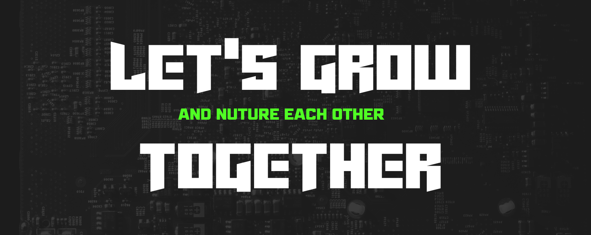
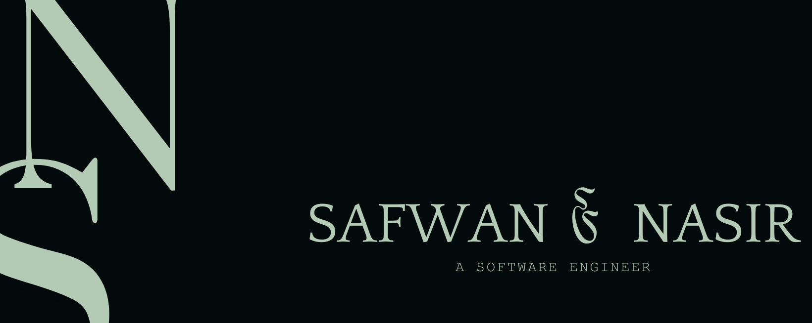
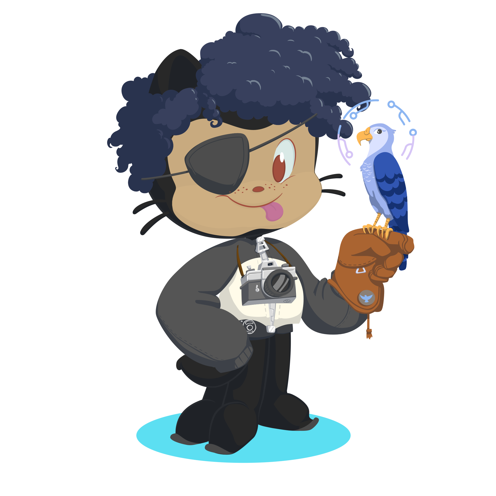
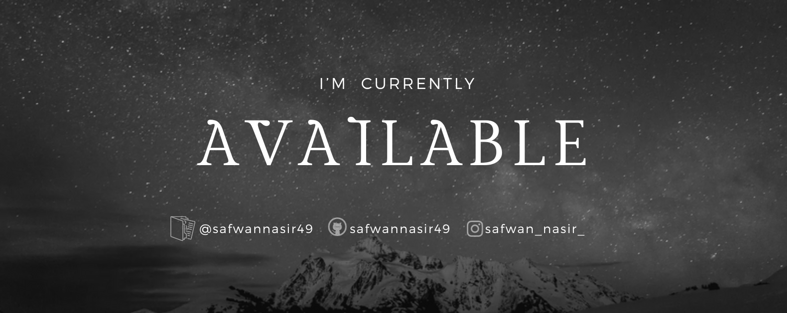

<h2 align="center"></h2>

  

<h1 align="center">
    
</h1>

<!--
-->

<h1 align="center">
    
</h1>

<!--
 <a href="https://x.com/SafwanNasir49" target="blank">-->

  
  
    
    
    
  
  
  

  

🌐 Enhancing my skills in Cloud Computing and Cyber Security

 

🛠️ Explore my portfolio and projects <a href="https://safwannasir49.github.io/Portfolio" target="_blank">💼</a>

 

🧑‍🏫 Happy to help with Java, Python, AI/ML

 

📧 Connect with me at 

 

📜 Discover my professional journey [here]

 

🌱 Passionate about learning Machine Learning and Artificial Intelligence

  

<h3 align="center">Connect with me:</h3>

       
    
    
    

   
<!--

-->

    

<!--
 -->

   

<h1 align="center">Technical Stack</h1>

    
(Click On the below Bagde icons ⬇️)

 

   

        <h2 align="center">Languages</h2>
        
        
        
        
        
        
        
        
    

        

   <h7>--</h7> 

        

            
            
            
            
            
            
            
            
    

    

    <h2 align="center">Tools</h2>
    
    
    
    
    
    
    
        
        
        

    

    

   <h7>--</h7> 

        

    

        
        
        
        
        
        
        
        

    

        <h2 align="center">Databases</h2>
        
        
    

        

    

        
        

    

<h1 align="center">Developer / Forums</h1>

  

        <h2 align="center">Machine Learning / Deep Learning</h2>
        
    
    
    
    
    
    
    
       
    
  

  

   <h7>--</h7> 

      

    

    

    
    
<table border="0" style="margin-top:30px; border:0px; width: 100%;" class="mt-4">

    

 
<h1 align="center">Challenges</h1>

<h1 align="center">Machine Learning</h1>

<h1>Curated DSA List</h1>

    

    

        
    

    

    

 

<h3 align="left">🏆 GitHub Trophies</h3>
    

  

 

 

   
 

     
 

 <h2 align="center">Read.Me Stats</h2>
<table>
  <tbody>  
    <tr>
        <td style="width: 50%;" align="center">
            
        </td>
        <td style="width: 50%;" align="center">
            
        </td>
    </tr>
    <tr>
        <td style="width: 100%;" align="center" colspan="2">
            
        </td>
    </tr>
    <tr>
        <td style="width: 100%;" align="center" colspan="2">
            
        </td>
    </tr>
  </tbody>
</table>

  

<!--

  <h2>🐍 My Contributions 🐍</h2>
   
  
     

-->

    

 <em><b>I love connecting with different people</b>, so if you want to say <b>hi, feel free to reach out!</b> :)</em>
 

