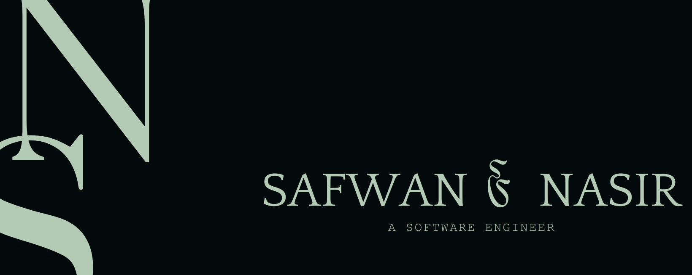

<h2 align="center"></h2>

  
<h1 align="center">
    
</h1>
<!--
-->

<h3 align="center">
    
</h3>

<!--
 <a href="https://x.com/SafwanNasir49" target="blank">-->

  

 

  

  

🌐 Enhancing my skills in Cloud Computing and Cyber Security

 

🛠️ Explore my portfolio and projects <a href="https://safwannasir49.github.io/Portfolio" target="_blank">💼</a>

 

🧑‍🏫 Happy to help with Java, Python, AI/ML

 

📧 Connect with me at 

 

📜 Discover my professional journey [here]

 

🌱 Passionate about learning Machine Learning and Artificial Intelligence

  

<h3 align="center">Connect with me:</h3>

       
    
    
    

   
<!--

-->

    

<!--
 -->

   

<h1 align="center">Technical Stack</h1>

 

   

        <h2 align="center">Languages</h2>
        
        
        
        
        
        
        
        
        
    

        

   <h7>--</h7> 

        

            
            
            
            
            
            
            
            
    

             

             
    

    <h2 align="center">Tools</h2>
         
    
    
    
    
    
    
    
        
        
        

    

    

   <h7>--</h7> 

        

    

        
        
        
        
        
        
        
        

         

         
    

        <h2 align="center">Databases</h2>
         
        
        
    

        

    

        
        

    

 

             
<h2 align="center">Developer / Forums</h2>
             

 

 
  

        <h2 align="center">Machine Learning / Deep Learning</h2>
       
        
    
    
    
    
    
    
    
       
    
  

  

   <h7>--</h7> 

      

    

    

             
    
 
     

 
<table border="0" style="margin-top:30px; border:0px; width: 100%;" class="mt-4">

        
    

    
 
 
 

<h1 align="center">
 
</h1>
     
 

        
     

        
     
    

      
    

    
        

<h3 align="center">Introduction To</h3>

   

### 30 Days Challenge

   

### Cracking Coding Interview

   

### Sprint Interview

   

### In-Depth Topics

   

### Comprehensive LeetCode Problem Set (1086 Problems)

   

### Data Structures & Algorithms
 

  

       
        

    

          

    
    

    
    

      

    

   
<h3 align="center">
 
</h3>

  
<!--Languages and Tools Section-->       
<h2 align="center">Tᴇᴄʜ sᴛᴀᴄᴋ & Lᴀᴛᴇsᴛ ʙʟᴏɢs</h2> 
<picture>
  <source media="(prefers-color-scheme: dark)" srcset="Images/Skills_Animation_Dark.gif">
  <source media="(prefers-color-scheme: light)" srcset="Images/Skills_Animation_White.gif">
  
</picture>
 

<h3 align="left">Current Learning</h3>
<ul align="left">
  <li>Deepening my knowledge in Machine Learning/Deep Learning and AI.</li>
  <li>Exploring advanced Web Devolepment patterns and state management techniques.</li>
  <li>Improving my skills in cloud computing with AWS and Azure.</li>
</ul>
  
<h3 align="left">Latest Blog Posts</h3>
<ul align="left">
    <li><a href="https://dev.to/safwan_nasir_51209157325d/exploring-the-frontier-of-ai-deep-learning-machine-learning-and-more-35bg">Exploring the Frontier of AI: Deep Learning, Machine Learning, and More</a></li>
    <li><a href="https://dev.to/dev_kiran/html-tags-you-might-not-know-about-3gk7">HTML Tags You Might Not Know About</a></li>
    <li><a href="https://dev.to/dev_kiran/meet-codiumate-your-coding-agent-47ie">Meet Codiumate - Your Coding Agent 🤖</a></li>
</ul>

</ul>
 
 
 
 

<!--

     
    

        

            
        

    

-->

<h1 align="center">
 
</h1>

    

         
    

    <h2 align="center">Data Pre-Processing (Section - 1)</h2>
        <h4>Data Preprocessing in Python & R</h4>

    

        
          
    

   
    <h2 align="center">Regression (Section - 2)</h2>

<!-- Simple Linear Regression -->

    <h4>Simple Linear Regression</h4>
    
    

<!-- Multiple Linear Regression -->

    <h4>Multiple Linear Regression</h4>
    
    

<!-- Polynomial Regression -->

    <h4>Polynomial Regression</h4>
    
    

<!-- Decision Tree Regression -->

    <h4>Decision Tree Regression</h4>
    
    

<!-- Random Forest Regression -->

    <h4>Random Forest Regression</h4>
    
    

<!-- Regression Model Selection -->

    <h4>Regression Model Selection</h4>
    
    

<!-- Support Vector Regression (SVR) -->

    <h4>Support Vector Regression (SVR)</h4>
    
    

    
<h2 align="center">Classification (Section - 3)</h2>
<!-- Logistic Regression -->

    <h4>Logistic Regression</h4>
    
    

<!-- Decision Tree Classification -->

    <h4>Decision Tree Classification</h4>
    
    

<!-- Random Forest Classification -->

    <h4>Random Forest Classification</h4>
    
    

<!-- Kernel SVM -->

    <h4>Kernel SVM</h4>
    
    

<!-- Naive Bayes -->

    <h4>Naive Bayes</h4>
    
    

<!-- K-Nearest Neighbors (KNN) -->

    <h4>K-Nearest Neighbors (KNN)</h4>
    
    

<!-- Support Vector Machine (SVM) -->

    <h4>Support Vector Machine (SVM)</h4>
    
    

    
<h2 align="center">Clustering (Section - 4)</h2>

<!-- K-Means Clustering -->

    <h4>K-Means Clustering</h4>
    
    

<!-- Hierarchical Clustering -->

    <h4>Hierarchical Clustering</h4>
    
    

    
<h2 align="center">Association Rule Learning (Section - 5)</h2>

<!-- Apriori -->

    <h4>Apriori</h4>
    
    

<!-- Eclat -->

    <h4>Eclat</h4>
    
    

    
<h2 align="center">Reinforcement Learning (Section - 6)</h2>

<!-- Upper Confidence Bound (UCB) -->

    <h4>Upper Confidence Bound (UCB)</h4>
    
    

<!-- Thompson Sampling -->

    <h4>Thompson Sampling</h4>
    
    

 

  

<h3 align="center">
 
</h3>

   

 <h1 align="center">
 
</h1>
 

  
 <!-- Section - 1 Field Of Data Science -->

    <h3 align="center">Field of Data Science (Section - 1)</h3>
     

   
<!-- Section - 2 Probability -->
<h3 align="center">Probability (Section-2)</h3>
 

    
    
    
    

  
<!-- Section - 3 Statistics -->
<h3 align="center">Statistics (Section - 3)</h3>
 

    
    
    
    
    
    
  

  

<!-- Section - 4 Advanced Statistical Methods -->
<h3 align="center">Advanced Statistical Methods (Section - 4)</h3>
 

    

<!-- Section - 5 Mathematics -->
<h3 align="center">Mathematics (Section - 5)</h3>
 

    

<!-- Section - 6 Deep Learning -->
<h3 align="center">Deep Learning (Section - 6)</h3>
 

    

<!-- Section - 7 Software Integration -->
<h3 align="center">Software Integration (Section - 7)</h3>
 

    

   
<h3 align="center">
 
</h3>

     <h1 align="center">
 
</h1>
 

      
     <h3>Data Handling (Section-1)</h3>
      
     

    
    
    
    

            

<h3 align="center">
 
</h3>
    

     

        

    

    
 <!--

    

   
 

 -->
 

<h2>Curated DSA List</h2>

      <h3 align="center">
 
</h3>

   
<h3 align="center">
 
</h3>
    

     

      
    

    
  <h3 align="center">
 
</h3>

<h2>Advanced Calculus - 1</h2>

    
    
    
    
    

   
<h2>Multivariate Calculus & Differential Equations</h2>

</a>

   
<h3 align="center">
 
</h3>

      

    

 

      
<h3 align="center">🏆 GitHub Trophies 🏆</h3>
   <!-- -->
    

  
  

 

 

   
 

     
 

 <h2 align="center">Read.Me Stats</h2>
<table>
  <tbody>  
    <tr>
        <td style="width: 50%;" align="center">
            
        </td>
        <td style="width: 50%;" align="center">
            
        </td>
    </tr>
    <tr>
        <td style="width: 100%;" align="center" colspan="2">
            
        </td>
    </tr>
    <tr>
        <td style="width: 100%;" align="center" colspan="2">
            
        </td>
    </tr>
  </tbody>
</table>

  

<!--

  <h2>🐍 My Contributions 🐍</h2>
   
  
     

-->

    

 <em><b>I love connecting with different people</b>, so if you want to say <b>hi, feel free to reach out!</b> :)</em>
 
 
  

  
<!-- Contact Section --> 

<h2 align="center" style="margin-bottom: 30px;">🤝 Cᴏɴɴᴇᴄᴛ Wɪᴛʜ Mᴇ 🤝</h2>

  

  

  

  

  

  

<!-- Buy Me a Coffee -->

  

  

<!-- Footer --> 

  

